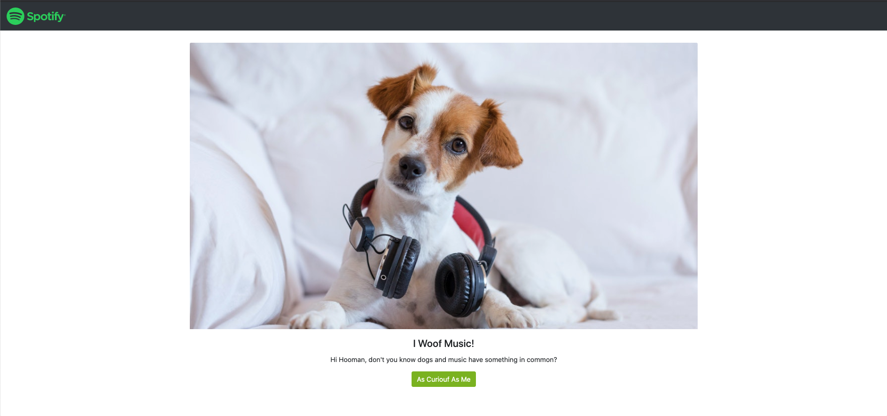

# Machine Learning using Spotify API

Spotify has python library called 'Spotipy' where we can use to extract songs/tracks, albums, playlist, artist, etc. in Spotify API.
 

## Idea Overview

Using user interaction, we will ask a few questions to the user to receive their interests on what kind of songs they want to listen to. From the data we extracted from Spotify API, we train the model using machine learning and model will then predict the songs and give song recommendation to the user that he/she might be interested in.

<b>Tools: </b> spotipy, pandas, json, matplotlib, sklearn, joblib, flask, javascript(D3, sessionStorage, jQuery)

<b>Result Website link: </b> https://spotify-woof.herokuapp.com/
  
<b> Steps: </b>
1. Extract Songs/Tracks Data from Spotify API (Spotipy) by Genres
2. Clean The Collected Data and Consolidate All Different Genres CSVs into One CSV
3. Create A Training and Testing Machine Learning Model and Decide The Best Model with Highest Accuracy
4. Build Flask App to Run Machine Learning and Make Prediction
5. Create JavaScript Code to Extract Data from User Choices and Passed Data to Flask
6. Build Website for User Interaction
  

### 1. Extract Songs/Tracks Data from Spotify API (Spotipy) by Genres

Spotify built a Python Library to extract Spotify data (e.g. songs/tracks, albums, playlists, artists, etc.) from Spotify API. The library is called 'Spotipy'. 

https://github.com/plamere/spotipy
  

Similar to general API, we do need the credentials to access Spotify API, which we can get from Spotify for Developer page.

https://developer.spotify.com/dashboard/login
  
Using jupyter notebook, we call and pull the list of tracks from each of these 7 genres from Spotipy:
1. Pop
2. Hiphop
3. Rock
4. Jazz
5. Kpop
6. Intrumental
7. ASMR

We extract 1000 songs/tracks for each genres, which gives us a total of 7000 songs/tracks in total.
  
### 2. Clean The Collected Data and Consolidate All Different Genres CSVs into One CSV

Once we extract all songs/tracks for these 7 genres, we clean the data using Pandas by filtering necessary columns only, removing any blank or N/A values, and consolidating each genres CSVs into one CSV file.

Spotify songs/tracks data consists of the following features information:
- Danceability - The higher the value, the easier it is to dance to this song. Danceability describes how suitable a track is for dancing based on a combination of muical elements including tempo, rhythm stability, beat strength, and overall regurality.
- Energy - the higher the value, the more energtic the song is. Energy represents a perceptual measure of intensity and activity. Typically, energetic tracks feel fast, loud, and noisy.
- Acousticness - The higher the value the more acoustic the song is.
- Instrumentalness - The higher the value the greater likelihood the track contains no vocal content. Instrumentalness predicts whether a track contains no vocals.
- Valence - The higher the value, the more positive mood for the song. Tracks with high valence sound more positive (e.g. happy, cheerful, euphoric), while tracks with low valence sound more negative (e.g. sad, depressed, angry).
- Speechiness - The higher the value the more spoken word the song contains.
- Loudness (dB) - The higher the value, the louder the song. Loudness values are averaged across the entire track and are useful for comparing relative loudness of tracks. Values typical range between -60 and 0 dB.
- Tempo (BPM) - The tempo of the song (beats per minute).
- Popularity - The higher the value the more popular the song is.

From these 9 features, we decide to focus on 4 features which are Loudness, Energy, Danceability, and Instrumentalness.
  
### 3. Create A Training and Testing Machine Learning Model and Decide The Best Model with Highest Accuracy

Using sklearn, we encode the genres into labels, then split the data to train (70%) and test data (30%), and scale the data using MinMaxScaler. 

Once the data has been trained and scaled, it is ready for us to perform different kinds of machine learning models and see the best accuracy to decide the best model we can use to predict.

Out of all models, we decide to go with KNN with the best and most reasonable accuracy result, and export the model to pickle file using joblib.
  
### 4. Build Flask App to Run Machine Learning and Make Prediction

Next step is to move the code we run in jupyter notebook to python file and build Flask which will run the data we receive from the user's choices and process it with machine learning to make prediction of the song recommendation.

First, we create the routes of each website pages containing question for the users to answer, which we will collect to perform the machine learning. But how to collect the data? We'll discuss this in the next step (#5).

Second, Flask will read the list of 7000 songs in CSV, load the pickle file with machine learning model, and input the collected data to the model.

Lastly, the last route ('/result') in Flask will send the song prediction result to the last page of the website and show the recommended song to user.
  
### 5. Create JavaScript Code to Extract Data from User Choices and Passed Data to Flask

Using the following tools in JavaScript we collect the data of user's choices and send it to Flask:
- D3 - Extract user's choices and store it to array
- sessionStorage - Pass the input of each user's choices from one website page to another
- jQuery - Send the collected data of user's choices to Flask in JSON format.
  
### 6. Build Website for User Interaction

Using Bootstrap, we build each website pages from home page, pages that guide the user with the question and options to choose, and the result page to show the recommended song for the user.

